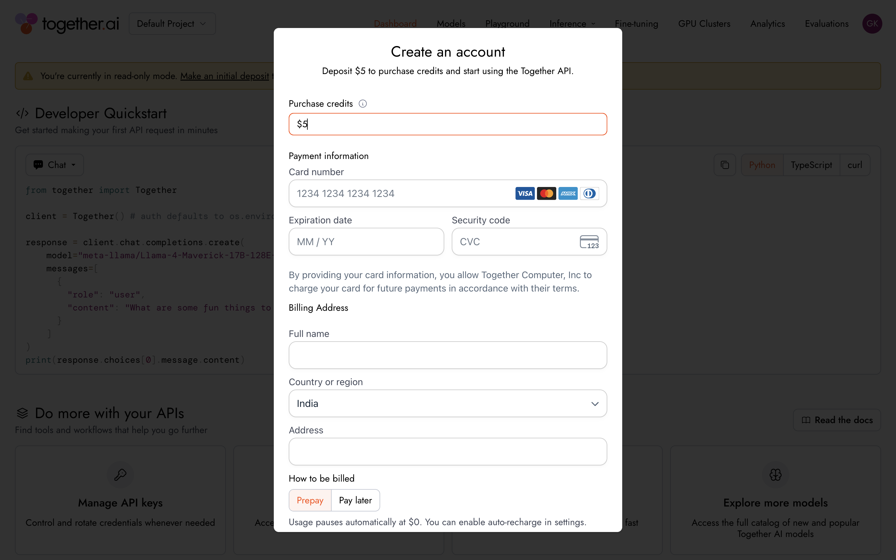
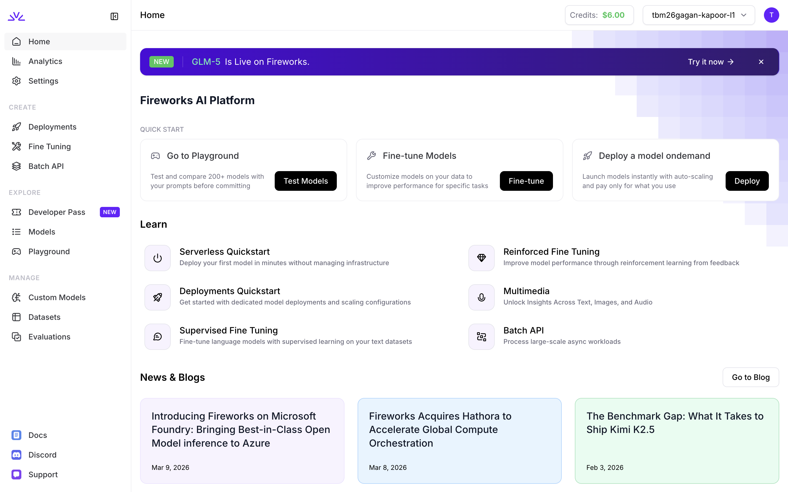
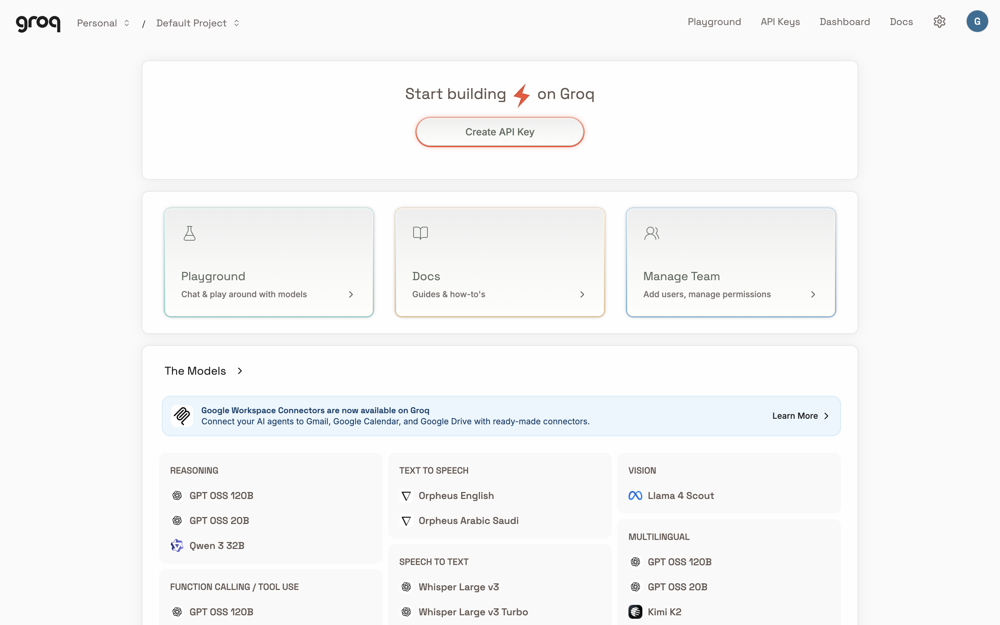
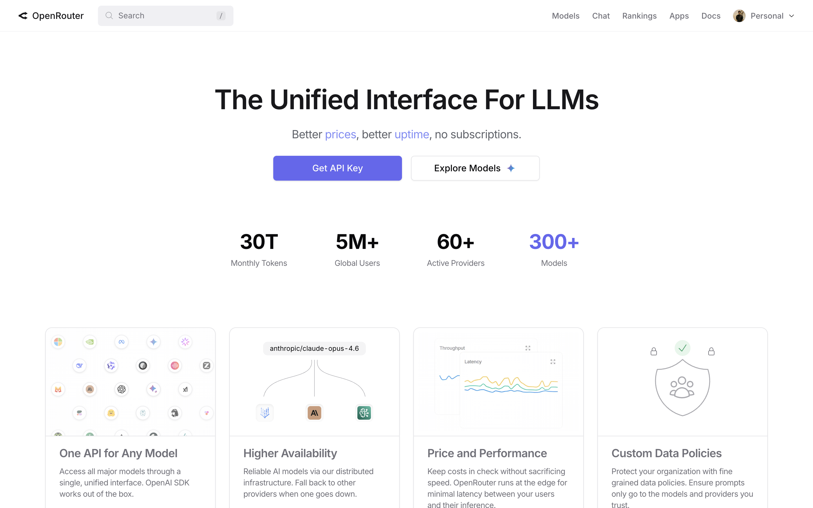

# Competitive Landscape

The open-source inference market is rapidly consolidating around a handful of well-funded players. **Yet no single competitor owns the full enterprise platform layer** — the combination of inference, FinOps, governance, and sovereign deployment that large organisations actually need. That gap is AI Gateway's opportunity.

---

## Key Competitors

#### Together AI

THREAT: HIGH

- **Funding:** $533M raised
- **Revenue:** ~$300M ARR
- **Models:** 227+ (chat, image, audio, video, embedding, moderation)
- **Strength:** Research-grade models, broadest modality coverage (text, image, video, audio, TTS), training + inference, GPU Clusters
- **Weakness:** Read-only mode without deposit, basic team management (Admin/Owner roles only), no compliance/governance features visible, no granular RBAC
- **New (2025-2026):** GLM-5, OpenAI GPT-OSS models, Kimi K2.5, Google Veo 3.0 video, Sora 2 video generation, cost analytics per project

#### Fireworks AI

THREAT: VERY HIGH

- **Funding:** $327M raised, $4B valuation
- **Revenue:** ~$130M ARR
- **Models:** 200+ (LLM, Audio, Image, Vision, Embeddings, Reranks)
- **Strength:** Cached vs uncached input pricing (cost optimization), Compound AI, Deployments, Fine Tuning, Batch API, Evaluations, Quotas & Reservations system
- **Weakness:** Tiered spending limits (Tier 1 = $50 max), no visible audit logs or compliance features, analytics page broken/empty
- **New (2025-2026):** Developer Pass program, acquired Hathora (compute orchestration), Microsoft Foundry partnership, Reinforced Fine Tuning

#### Groq

THREAT: MEDIUM

- **Status:** Nvidia acquisition ~$6.5B
- **Models:** ~15 curated models (focused catalog)
- **Strength:** Custom LPU silicon, extreme speed, 3-tier pricing (Free/Developer/Enterprise), most mature enterprise feature set among competitors (SSO, SCIM, Audit Logs, Data Controls, Projects)
- **Weakness:** Very limited model catalog, strict rate limits (30 RPM free tier), supply-constrained
- **New (2025-2026):** Google Workspace Connectors (Gmail, Calendar, Drive), OpenAI GPT-OSS models, Compound AI agents, upgraded Enterprise tier with 90-day audit log retention

#### OpenRouter

THREAT: MEDIUM

- **Valuation:** ~$500M
- **Users:** 5M+ users, 30T tokens/month, 60+ providers
- **Models:** 658 (largest catalog by far — open + proprietary)
- **Strength:** BYOK (Bring Your Own Key) for 45+ providers, Auto Router (intelligent model routing), Guardrails (ZDR, provider restrictions, spending limits), Privacy Settings (training opt-out), Observability, Plugins system, Management Keys
- **Weakness:** Aggregator model with thin margins, no SSO/RBAC, no fine-tuning, no dedicated compute, recent outages (Feb 2026)
- **New (2025-2026):** Auto Exacto adaptive quality routing, model benchmarks on pages, free model router, BYOK key priority/fallback system

---

## Feature Comparison

| Capability | Description | AI Gateway | Together AI | Fireworks AI | Groq | OpenRouter |
|---|---|---|---|---|---|---|
| **OpenAI + Anthropic Compatible API** | Drop-in replacement for both the OpenAI SDK (`/v1/chat/completions`) and Anthropic SDK (`/v1/messages`) — change your base URL and API key, existing code works instantly. Zero migration effort from either SDK. | :white_check_mark: | :white_check_mark: | :white_check_mark: | :white_check_mark: | :white_check_mark: |
| **Streaming (SSE)** | Real-time token-by-token output via Server-Sent Events for responsive chat and interactive AI applications. | :white_check_mark: | :white_check_mark: | :white_check_mark: | :white_check_mark: | :white_check_mark: |
| **Embeddings API** | Vector embedding generation for semantic search, RAG pipelines, and similarity matching via `/v1/embeddings`. | :white_check_mark: | :white_check_mark: | :white_check_mark: | :x: | :white_check_mark: |
| **Function / Tool Calling** | Structured tool-use support matching the OpenAI function-calling spec, enabling agentic workflows and structured output. | :white_check_mark: | :white_check_mark: | :white_check_mark: | Partial | :white_check_mark: |
| **Vision / Multimodal** | Support for models that accept image inputs alongside text (e.g., LLaVA, Qwen-VL). | :white_check_mark: | :white_check_mark: | :white_check_mark: | :x: | :white_check_mark: |
| **Interactive Playground** | Browser-based model testing with real-time streaming and parameter adjustment — no code required. | :white_check_mark: | :white_check_mark: | :white_check_mark: | :white_check_mark: | :white_check_mark: |
| **Python & TypeScript SDKs** | Official client libraries with full type hints, async support, and streaming. Published on PyPI and npm. | :white_check_mark: | :white_check_mark: | :white_check_mark: | :white_check_mark: | Community |
| **Framework Integrations** | Pre-built connectors for LangChain, Vercel AI SDK, LlamaIndex, and CrewAI. | :white_check_mark: | :white_check_mark: | :white_check_mark: | Partial | :white_check_mark: |
| **Prepaid (Credits)** | Purchase credits upfront, deducted per million tokens at model-specific rates. $5 free credit on signup. | :white_check_mark: | :white_check_mark: | :white_check_mark: | :white_check_mark: | :white_check_mark: |
| **Postpaid (Invoice)** | Monthly invoicing per million tokens consumed. Committed spend agreements available. | :white_check_mark: | :white_check_mark: | :white_check_mark: | :white_check_mark: | :x: |
| **Auto-Scaling** | Elastic capacity that scales with demand without manual intervention. | :white_check_mark: | :white_check_mark: | :white_check_mark: | Limited | N/A (aggregator) |
| **99.9%+ Uptime SLA** | Guaranteed availability with public status page, incident timelines, and post-mortems. | 99.99% | :white_check_mark: | :white_check_mark: | :white_check_mark: | Best-effort |
| **Multi-model API** | Single API endpoint to access many open-source and fine-tuned models (LLaMA, DeepSeek, Mistral, Qwen, Command R) with OpenAI + Anthropic compatible interfaces — no separate integrations needed. Self-hosted on K8s GPUs. | :white_check_mark: | :white_check_mark: | :white_check_mark: | Limited | :white_check_mark: |
| **Cost Intelligence / FinOps** | Real-time spend dashboards, per-team/project cost allocation, budget alerts, spend forecasting, and intelligent routing that delivers 20–40% cost savings. The AI FinOps layer no competitor offers. | :white_check_mark: | Basic (per-product daily cost charts) | Basic (spending limits by tier) | Basic (per-model usage tracking) | Basic (per-key usage tracking) |
| **Enterprise Key Mgmt** | Full RBAC with team hierarchies, API key scoping (model, rate, cost, IP, expiry restrictions), department-level billing with chargeback, SSO/SAML, and complete audit trails. | :white_check_mark: | Basic (Admin/Owner roles, project-level keys) | Basic (API keys, Secrets, per-account quotas) | :white_check_mark: (SSO, SCIM, Projects, Audit Logs — Enterprise tier) | Partial (per-key limits, guardrails, management keys) |
| **Intelligent Routing** | Auto-routing to optimal model/provider based on cost, latency, and quality. Fallback chains across providers. | :white_check_mark: | :x: | :x: | :x: | :white_check_mark: (Auto Router, provider sort, BYOK fallback) |
| **BYOK (Bring Your Own Key)** | Use your own provider API keys for direct billing while keeping platform features. | :white_check_mark: | :x: | :x: | :x: | :white_check_mark: (45+ providers) |
| **Guardrails & Data Controls** | Privacy settings, ZDR endpoints, model allow/block lists, provider restrictions. | :white_check_mark: | :x: | :x: | Partial (Model Terms, Data Controls — Enterprise) | :white_check_mark: (ZDR, provider restrictions, training opt-out) |
| **Batch Processing** | Async bulk inference for cost-efficient large-scale workloads. | :white_check_mark: | :x: | :white_check_mark: | :white_check_mark: (Developer tier) | :x: |
| **Fine-tuning Pipeline** | End-to-end lifecycle: data preparation → LoRA/QLoRA training → live evaluation → A/B traffic splitting → one-click rollback → drift monitoring. Creates the strongest switching cost ($5–50K to recreate). | :white_check_mark: | :white_check_mark: | :white_check_mark: (+ Reinforced Fine Tuning) | LoRA (Enterprise only) | :x: |
| **Evaluations** | Built-in model evaluation and comparison tooling. | :white_check_mark: | :white_check_mark: | :white_check_mark: | :x: | :x: |
| **Audit Logs** | Complete audit trail of all organization actions. | :white_check_mark: (7+ year) | :x: | :x: | :white_check_mark: (7-day Dev / 90-day Enterprise) | :x: |
| **Compliance / Governance** | SOC 2 Type II, HIPAA, GDPR, EU AI Act, PCI-DSS, ISO 27001 — built into auth/authz layers from day one. Zero Data Retention (ZDR) with cryptographic proof. PII auto-redaction. | :white_check_mark: | :x: | :x: | Partial (Data Controls) | Partial (ZDR endpoints available) |
| **Sovereign AI / MENA** | Data residency in UAE (Abu Dhabi), Saudi Arabia (Riyadh), EU (Frankfurt), and US (Virginia). Gulf-region regulatory pre-configuration (UAE PDPL, Saudi PDPL, Bahrain DPL). Arabic-English bilingual support. | :white_check_mark: | :x: | :x: | :x: | :x: |
| **Custom Silicon** | Strategic hardware partnership reducing Nvidia dependency. AI Gateway + GPU partnerships RISC-V accelerators = full-stack sovereign AI (software + hardware). | GPU partnerships | :x: | :x: | LPU | :x: |

---

## Competitive Positioning Map

<svg viewBox="0 0 700 500" xmlns="http://www.w3.org/2000/svg" style="max-width:700px;width:100%;margin:0 auto;display:block;">
  <text x="350" y="25" text-anchor="middle" style="fill:var(--ig-text)" font-size="16" font-weight="700" font-family="Space Grotesk,sans-serif" letter-spacing="0.04em">COMPETITIVE POSITIONING</text>
  <rect x="80" y="40" width="280" height="200" style="fill:var(--ig-accent-soft);stroke:var(--ig-border)" stroke-width="1"/>
  <rect x="360" y="40" width="280" height="200" style="fill:var(--ig-secondary-soft);stroke:var(--ig-border)" stroke-width="1"/>
  <rect x="80" y="240" width="280" height="200" fill="transparent" style="stroke:var(--ig-border)" stroke-width="1"/>
  <rect x="360" y="240" width="280" height="200" style="fill:var(--ig-accent-soft);stroke:var(--ig-border)" stroke-width="1"/>
  <text x="220" y="145" text-anchor="middle" style="fill:var(--ig-text-muted)" font-size="14" font-weight="600" font-family="Space Grotesk,sans-serif" letter-spacing="0.06em" opacity="0.4">INFERENCE SPECIALISTS</text>
  <text x="500" y="145" text-anchor="middle" style="fill:var(--ig-text-muted)" font-size="14" font-weight="600" font-family="Space Grotesk,sans-serif" letter-spacing="0.06em" opacity="0.4">FULL PLATFORM LEADERS</text>
  <text x="220" y="345" text-anchor="middle" style="fill:var(--ig-text-muted)" font-size="14" font-weight="600" font-family="Space Grotesk,sans-serif" letter-spacing="0.06em" opacity="0.4">NICHE PLAYERS</text>
  <text x="500" y="345" text-anchor="middle" style="fill:var(--ig-text-muted)" font-size="14" font-weight="600" font-family="Space Grotesk,sans-serif" letter-spacing="0.06em" opacity="0.4">PLATFORM BUILDERS</text>
  <circle cx="136" cy="80" r="5" style="fill:var(--ig-text-muted)"/>
  <text x="148" y="84" style="fill:var(--ig-text-muted)" font-size="13" font-family="Space Grotesk,sans-serif">Groq</text>
  <circle cx="178" cy="100" r="5" style="fill:var(--ig-text-muted)"/>
  <text x="190" y="104" style="fill:var(--ig-text-muted)" font-size="13" font-family="Space Grotesk,sans-serif">Fireworks AI</text>
  <circle cx="220" cy="140" r="5" style="fill:var(--ig-text-muted)"/>
  <text x="232" y="130" style="fill:var(--ig-text-muted)" font-size="13" font-family="Space Grotesk,sans-serif">Together AI</text>
  <circle cx="164" cy="260" r="5" style="fill:var(--ig-text-muted)"/>
  <text x="176" y="264" style="fill:var(--ig-text-muted)" font-size="13" font-family="Space Grotesk,sans-serif">OpenRouter</text>
  <circle cx="528" cy="120" r="7" style="fill:var(--ig-accent);stroke:var(--ig-accent-soft)" stroke-width="3"/>
  <text x="544" y="124" style="fill:var(--ig-accent)" font-size="14" font-weight="700" font-family="Space Grotesk,sans-serif">AI Gateway</text>
  <text x="80" y="470" style="fill:var(--ig-text-muted)" font-size="11" font-family="Space Grotesk,sans-serif" letter-spacing="0.05em">LOW PLATFORM CAPABILITY</text>
  <text x="640" y="470" text-anchor="end" style="fill:var(--ig-text-muted)" font-size="11" font-family="Space Grotesk,sans-serif" letter-spacing="0.05em">HIGH PLATFORM CAPABILITY</text>
  <text x="40" y="440" transform="rotate(-90,40,280)" style="fill:var(--ig-text-muted)" font-size="11" font-family="Space Grotesk,sans-serif" letter-spacing="0.05em">LOW INFERENCE CAPABILITY</text>
  <text x="40" y="80" transform="rotate(-90,40,80)" style="fill:var(--ig-text-muted)" font-size="11" font-family="Space Grotesk,sans-serif" letter-spacing="0.05em">HIGH INFERENCE CAPABILITY</text>
</svg>

---

## Our Advantage

#### Why AI Gateway Wins

- **"Full Platform Leader" quadrant** — AI Gateway is the only player positioned in the upper-right, combining strong inference *and* deep platform capability.
- **Unique stack** — No competitor combines inference + FinOps + governance + sovereign AI in a single platform.
- **Distribution moat** — IHC backing and the Infinia Technologies enterprise customer base provide a go-to-market advantage competitors cannot replicate.
- **Timing window** — 18-24 months before market consolidation (2027-2028). First-mover in the enterprise platform layer locks in switching costs before incumbents expand.

---

## In-Depth Competitor Research

*Based on live dashboard exploration of each competitor platform (March 2026).*

### Together AI — Deep Dive

**Platform Architecture:** Together AI operates as a full-stack inference and training platform. The dashboard is organized around: Dashboard (quickstart), Models (catalog), Playground, Inference, Fine-tuning, GPU Clusters, Analytics, and Evaluations.

**Model Catalog (227+ models):**

- Broadest modality coverage of any competitor: chat/LLM, image generation, video generation, audio (TTS + transcription), embeddings, and content moderation
- Featured models include GLM-5 ($1.00/$3.20), Qwen3.5 397B ($0.60/$3.60), MiniMax M2.5 ($0.30/$1.20), Kimi K2.5 ($0.50/$2.80)
- Video generation: Google Veo 3.0, Sora 2/2 Pro, Kling 2.1, PixVerse v5, MiniMax Hailuo, ByteDance Seedance
- Image generation: FLUX.1/2 variants, Ideogram 3.0, Stable Diffusion, HiDream, Google Imagen 4.0
- Audio: Kokoro 82M TTS, Orpheus 3B, Whisper large-v3, Cartesia Sonic 1/2/3
- Free models available (ServiceNow Apriel)

**Pricing:**

- Credit-based prepaid system with auto-recharge thresholds
- Per-token pricing ranges from $0.02/M (Gemma 3N) to $7.00/M output (DeepSeek R1-0528)
- Video pricing: $0.14-$3.20 per video; Image pricing: $0.0006-$0.075 per image
- Requires initial deposit to unlock full access (read-only mode otherwise)
- Serverless and Dedicated deployment options per model

**Enterprise & Team Features:**

- Organization-level management with Project hierarchy
- Member roles: Admin and Owner (no granular RBAC)
- Per-project: API Keys, Collaborators, Cost Analytics
- Organization-level: General settings, Project List, Members, Billing
- SSH Key management, Integrations, Files storage
- GPU Cluster Projects for dedicated compute

**FinOps:**

- Daily cost breakdown by product category
- Monthly spend tracking with date range filtering
- Per-project cost analytics
- Auto-recharge with configurable thresholds
- Invoice history with download capability
- Tax ID configuration (international)

**Gaps AI Gateway Can Exploit:**

- No compliance/governance layer (no SOC 2, HIPAA, GDPR mentions)
- No audit logs
- Basic RBAC (only Admin/Owner — no viewer, billing, developer roles)
- No intelligent routing or provider failover
- No data residency controls
- Read-only mode gatekeeping creates friction for evaluation

### Fireworks AI — Deep Dive

**Platform Architecture:** Fireworks AI is organized into three sections — CREATE (Deployments, Fine Tuning, Batch API), EXPLORE (Developer Pass, Models, Playground), and MANAGE (Custom Models, Datasets, Evaluations, Account, Billing, Users & Access, API Keys, Secrets, Quotas, Reservations).

**Model Catalog (200+ models):**

- Categories: LLM, Audio, Image, Vision, Embeddings, Reranks
- Unique pricing innovation: **cached vs uncached input tokens** (e.g., Kimi K2.5: $0.60/M uncached, $0.10/M cached — 83% savings on cached prompts)
- Featured: NVIDIA Nemotron 3 Super 120B, MiniMax-M2.5, GLM-5, Kimi K2.5, Deepseek v3.2
- Embedding and reranking models (Qwen3 Embedding/Reranker series)
- Context windows up to 262k tokens

**Pricing & Billing:**

- Tiered spending system: Tier 1 = $50/month max (default with payment method)
- Credits system ($6 free credits on signup)
- Monthly billing cycle with invoicing
- Spending limit slider within current tier
- CSV export of invoice data

**Enterprise & Team Features:**

- Users & Access management (page was returning 404 — possibly access-restricted)
- API Keys with per-key management
- Secrets vault for sensitive configuration
- Quotas system for rate limiting
- Reservations for dedicated capacity
- No visible SSO, SCIM, or audit log features

**Unique Capabilities:**

- **Deployments**: On-demand model deployment with auto-scaling (pay-per-use)
- **Reinforced Fine Tuning**: RLHF-based model improvement (unique among competitors)
- **Batch API**: Async bulk processing for large workloads
- **Evaluations**: Built-in model evaluation tooling
- **Developer Pass**: New program for developer access/perks
- **Hathora Acquisition (Mar 2026)**: Acquired for global compute orchestration
- **Microsoft Foundry Partnership**: Bringing inference to Azure

**Gaps AI Gateway Can Exploit:**

- No audit logs or compliance certifications visible
- Tiered spending limits create friction for scaling (need tier upgrades)
- Analytics page returned 404 (reliability concern)
- No routing/failover capabilities
- No data residency or sovereignty features
- No BYOK or multi-provider support

### Groq — Deep Dive

**Platform Architecture:** GroqCloud console is organized with project-level navigation: Playground, API Keys, Dashboard, Docs. Settings split into Organization (General, Billing, Team, Profile, Limits, Usage, Model Terms, Projects, Data Controls, Audit Logs) and Project (General, Limits).

**Model Catalog (~15 curated models):**

- Deliberately focused catalog optimized for LPU hardware
- Categories: Reasoning (GPT-OSS 120B/20B, Qwen 3 32B), Function Calling, Text-to-Speech (Orpheus), Speech-to-Text (Whisper), Vision (Llama 4 Scout), Multilingual, Safety/Moderation
- Google Workspace Connectors: Gmail, Google Calendar, Google Drive integration for AI agents
- Compound AI agents: groq/compound and groq/compound-mini

**Pricing — Three-Tier Model (most structured among competitors):**

- **Free**: Build and test, community support, basic rate limits (30 RPM, 6K-30K TPM per model)
- **Developer**: Pay per token, higher limits, chat support, Flex Service Tier, Batch Processing, Spend Limits, Audit Logs (7-day retention)
- **Enterprise**: Custom pricing, scalable capacity, dedicated support, LoRA inference, SSO & SCIM, Audit Logs (90-day retention)

**Enterprise Features (most mature among competitors):**

- **SSO & SCIM** (Enterprise tier) — only competitor with identity federation
- **Audit Logs**: 7-day (Developer) / 90-day (Enterprise) retention
- **Data Controls**: Organization-level data governance
- **Projects**: Multi-project organization with per-project limits
- **Team Management**: Add users, manage permissions
- **Model Allow/Block Lists**: Choose which models to allow or block per organization
- **Per-Model Rate Limits**: Granular RPM, RPD, TPM, TPD limits per model

**Rate Limits (Free Tier - detailed):**

- GPT-OSS 120B: 30 RPM, 1K RPD, 8K TPM, 200K TPD
- Llama 3.3 70B: 30 RPM, 1K RPD, 12K TPM, 100K TPD
- Whisper: 20 RPM, 2K RPD, 7.2K audio seconds/hour
- Orpheus TTS: 10 RPM, 100 RPD, 1.2K TPM

**Gaps AI Gateway Can Exploit:**

- Very limited model catalog (~15 vs 200+ elsewhere)
- No fine-tuning on Free/Developer tiers (LoRA Enterprise-only)
- No image/video generation models
- No embeddings (inference-only focus)
- Hardware-locked — all inference on proprietary LPU silicon
- Post-Nvidia acquisition uncertainty on pricing/strategy
- No multi-provider routing or BYOK

### OpenRouter — Deep Dive

**Platform Architecture:** OpenRouter's workspace is organized into API Keys, Guardrails, BYOK, Routing, Presets, Plugins, Observability. Account section: Activity, Logs, Credits, Management Keys, Preferences.

**Model Catalog (658 models — largest by far):**

- Spans all major providers: OpenAI, Anthropic, Google, Meta, Mistral, Qwen, DeepSeek, MiniMax, and dozens more
- Advanced filtering: input/output modalities, context length, pricing, series, categories, parameters, distillable, ZDR, providers, authors
- Sorting: newest, most popular, weekly trend, pricing, context length, throughput, latency
- Per-model: token usage stats, weekly trends, category rankings
- Latest models: GPT-5.4 family, Claude Opus 4.6, Gemini 3.1 Pro, MiMo-V2, Seedance 1.5 Pro

**Pricing:**

- Credit-based system, no subscription tiers
- Per-model pricing from providers (pass-through with margin)
- Per-key spending limits configurable
- No monthly caps or tier restrictions

**Unique Platform Features (strongest among competitors):**

- **BYOK (Bring Your Own Key)**: Support for 45+ providers (AI21, Amazon Bedrock, Anthropic, Azure, Google, OpenAI, etc.). Key priority and fallback — your key first, OpenRouter credits as fallback. "Always use this key" option to prevent any fallback.
- **Auto Router**: Intelligent routing to best model per request. Configurable allowed models with wildcard patterns. Provider sort options.
- **Guardrails**: Data consent controls, spending limits per key/member, model restrictions, usage policies. ZDR (Zero Data Retention) endpoint filtering. Provider allow/block lists. Training opt-out toggles.
- **Privacy Settings**: Enable/disable paid endpoints that train on inputs. Enable/disable free endpoints that train on inputs. Enable/disable endpoints that publish prompts. ZDR-only mode.
- **Plugins System**: Extensibility through plugins
- **Observability**: Built-in monitoring (page loading during exploration)
- **Management Keys**: Separate keys for administrative operations
- **Rankings**: Public model and app usage rankings with token volume data

**Enterprise & Team:**

- Workspace-based organization
- Per-key and per-member guardrails
- No SSO/SCIM
- No traditional RBAC roles
- Management keys for admin operations

**Scale Metrics:**

- 30T monthly tokens processed
- 5M+ global users
- 60+ active providers
- 300+ models (site says 300+, catalog shows 658)
- 250K+ apps using OpenRouter

**Recent Developments:**

- Auto Exacto: Adaptive quality routing (default on, Mar 2026)
- Benchmarks on model pages (Feb 2026)
- Free model router (Feb 2026)
- Outages on Feb 17 and 19, 2026 (reliability concern)
- Video generation API in alpha (Seedance, Sora 2, Veo 3.1)

**Gaps AI Gateway Can Exploit:**

- Pure aggregator — no owned infrastructure or GPUs
- No fine-tuning capability
- No SSO, SCIM, or enterprise identity management
- No audit logs
- No compliance certifications
- Thin margins on pass-through inference
- Recent reliability issues (Feb 2026 outages)
- No dedicated compute or reserved capacity
- No sovereign deployment options

---

## Key Strategic Insights

#### What We Learned From Live Dashboard Research

1. **The enterprise gap is real and growing.** Only Groq has SSO/SCIM (Enterprise tier only). No competitor offers comprehensive compliance (SOC 2, HIPAA, GDPR) or sovereign deployment. This validates AI Gateway's positioning.

2. **OpenRouter's routing and BYOK features are the closest competitive threat to our gateway model.** Their guardrails, provider restrictions, and ZDR controls are sophisticated. We should match and exceed these while adding enterprise layers they lack.

3. **Fireworks AI's cached input pricing is a smart innovation** — 83% savings on cached prompts. We should consider implementing prompt caching with similar or better economics.

4. **Together AI has the broadest model coverage** including video generation (Veo 3, Sora 2, Kling) and advanced audio. If we focus initially on text/chat, we should have a clear multimodal roadmap.

5. **Groq's 3-tier model is the most enterprise-ready among competitors** — Free, Developer, Enterprise with progressive feature unlocks. This validates tiered pricing, but their tiny model catalog (~15 models) is a fatal weakness for enterprise adoption.

6. **All competitors have basic FinOps** — daily cost charts, spending limits, usage tracking. But none offer per-team cost allocation, budget forecasting, intelligent cost-optimized routing, or chargeback. This remains our strongest differentiator.

7. **Batch processing is becoming table stakes** — both Fireworks and Groq offer it. We need this at launch.

8. **Evaluations tooling is emerging** — Together AI and Fireworks both have it. This should be on our roadmap.

