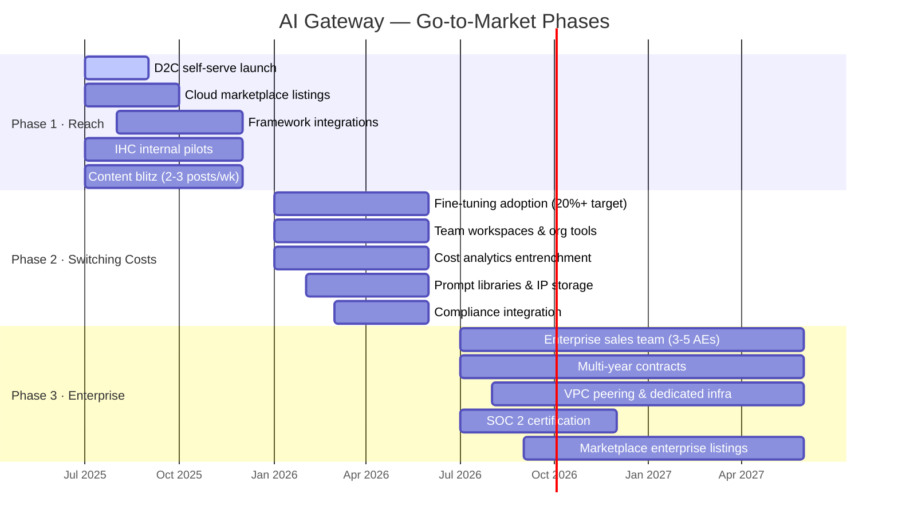
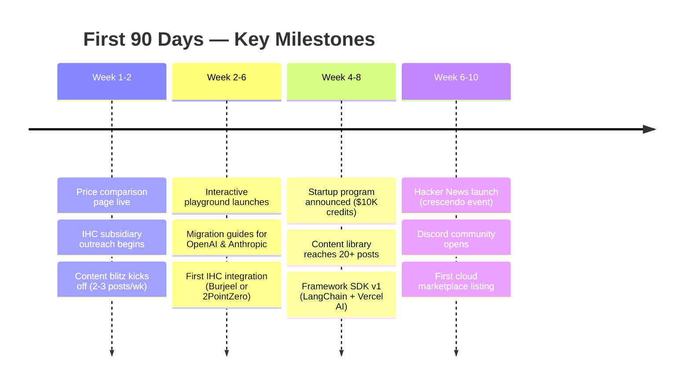

# Go-to-Market Strategy

A **3-phase strategy** that balances reach maximisation with switching-cost building — powered by IHC's distribution advantage across 422 subsidiaries. Every phase has a clear objective: **Phase 1** floods the top of funnel, **Phase 2** makes leaving painful, and **Phase 3** lands seven-figure enterprise contracts.

---

## 3-Phase GTM Timeline

---

### Phase 1: Reach (Months 1-6)

> **Goal:** Maximise top-of-funnel signups and generate first revenue through self-serve and IHC pilots.

- **D2C self-serve** — 2-minute onboarding: landing page to first API call. Zero-friction credit card billing.
- **Cloud marketplaces** — List on AWS, GCP, and Azure. Enterprise sales cycle drops to **2-4 weeks** (vs. 6-12 months for direct procurement).
- **Framework integrations** — Ship first-class support for LangChain (80K+ GitHub stars), Vercel AI SDK (500K+ users), LlamaIndex, and CrewAI. Developers discover AI Gateway where they already build.
- **IHC internal pilots** — Burjeel (healthcare), ALDAR (real estate), 2PointZero (fintech). Real workloads from day one with executive sponsorship.
- **Content blitz** — 2-3 blog posts per week: benchmark content, migration guides, cost comparisons, and integration tutorials.

### Phase 2: Switching Costs (Months 6-12)

> **Goal:** Deepen platform entrenchment so that leaving AI Gateway means losing tools, data, and workflows.

- **Fine-tuning adoption** — Target 20% of Pro/Enterprise customers running custom fine-tunes. Models trained on AI Gateway do not port easily.
- **Team workspaces** — Organisational coordination costs: shared billing, role-based access, usage dashboards. Once a team is onboard, switching requires group consensus.
- **Cost analytics entrenchment** — Historical spend data, model-level cost breakdowns, budget alerts. Information lock-in — this data does not exist elsewhere.
- **Prompt libraries** — Customer IP stored on-platform: versioned prompts, evaluation datasets, A/B test results.
- **Compliance integration** — Audit trails, data residency configs, policy enforcement. Once compliance workflows depend on AI Gateway, ripping them out is a non-starter.

### Phase 3: Enterprise Expansion (Months 12-24)

> **Goal:** Land and expand six- and seven-figure enterprise contracts with deep technical lock-in.

- **Enterprise sales team** — 3-5 Account Executives + Solutions Engineers + Customer Success Managers.
- **Multi-year contracts** — 1-3 year terms with committed spend minimums and volume discounts.
- **VPC peering** — Dedicated infrastructure for the deepest technical lock-in. Customer data never leaves their cloud.
- **SOC 2 certification** — Binary gate for enterprise procurement. No SOC 2 = no deal. Target completion by Month 12.
- **Cloud marketplace enterprise listings** — Private offers, custom pricing, EDP/MACC burn-down for AWS and Azure customers.

---

## IHC Distribution Advantage

422

IHC Subsidiaries

2-4 wk

Internal Sales Cycle

~$0

Internal CAC

$5-50K

External CAC (avoided)

#### Why This Matters

**422 subsidiaries = captive market.** Internal sales cycles run **2-4 weeks** versus 6-12 months externally, and internal CAC is effectively **$0** versus $5-50K per external enterprise customer.

**Conservative estimate:** 30-50 subsidiaries at $5-10K/month = **$1.8-6.0M annually**.

**Ambitious estimate:** Top-10 high-volume subsidiaries at $50-500K/month = **$6-60M annually**.

This is distribution leverage that no pure-play competitor can replicate. AI Gateway starts with revenue before spending a dollar on external marketing.

---

## Developer Marketing

### Guerrilla Tactics

| Tactic | Purpose | Expected Impact |
|---|---|---|
| **Competitor bill-shock monitor** | Track price hikes from OpenAI, Anthropic, etc. and publish instant "switch & save" content | Captures high-intent switchers |
| **LLM price tracker** | Real-time pricing comparison across all providers (SEO magnet) | Organic traffic + brand authority |
| **Model benchmark leaderboard** | Neutral, reproducible benchmarks developers trust | Community credibility, backlinks |

### Community & Organic

- **Discord server** — Dedicated channels for each framework integration. Goal: 5K+ members in 6 months.
- **r/LocalLLaMA** (380K+ members) — Active participation, benchmark posts, AMA threads.
- **Twitter Spaces** — Weekly "Model Monday" sessions: new model deep-dives, live cost comparisons.

### Paid Media

$1.5-3M

Year 1 Budget

$12-50

Blended CPA

60-124K

Expected Signups

### Events & Launch Moments

- **GITEX** (170K+ attendees) — Anchor event for MENA enterprise pipeline.
- **NeurIPS** — Research community credibility, ML engineer recruiting.
- **AI Engineer Summit** — Builder-focused, high developer density.
- **Hacker News launch** — Target 500+ upvotes. Expected result: 10K-50K signups in 48 hours. Treat as a crescendo event with full team war-room support.

---

## Channel Priority

Ordered by strategic importance — **own the relationship first, then extend reach:**

1. **D2C self-serve** — Highest priority. Own the data, own the upsell path, own the margin. Every other channel feeds here.
2. **Cloud marketplaces** — Enterprise budget access without procurement friction. AWS Marketplace alone unlocks EDP spend.
3. **Framework integrations** — Embedded distribution. Developers choose AI Gateway because their tools already support it.
4. **IHC Group internal** — Greenfield market with executive sponsorship. Zero CAC, fast close, real production workloads.
5. **Enterprise direct sales** — Phase 3 priority. Requires SOC 2 certification and a proven product. Do not hire AEs until the platform sells itself.

---

## 90-Day Quick Wins

#### Expected 90-Day Output

- **$100-500K MRR** from IHC pilots + early self-serve adoption
- **15K-60K signups** across self-serve, HN launch, and content-driven organic
- **500+ startup program applications** from the $10K credits offer
- **3+ IHC subsidiaries** in active production usage

The 90-day plan is designed to generate proof points that de-risk the Series A narrative: real revenue, real usage, real enterprise customers.

