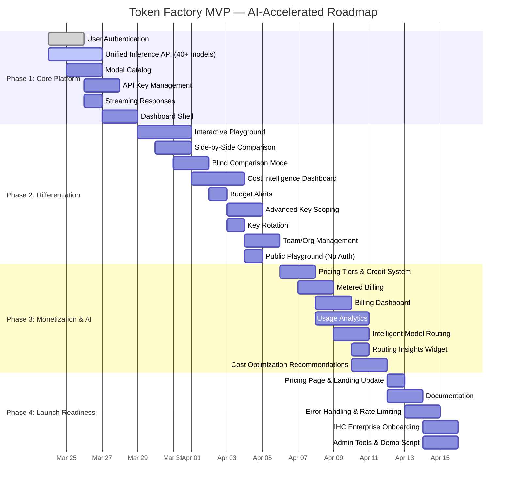

# Product Strategy

!!! info "Headline"
    AI Gateway's product strategy is built on **four concentric levels of value** — from core inference to AI operations intelligence — with a clear roadmap to capture market leadership before the consolidation window closes.

---

## 4-Level Product Strategy

| Level | Description | Examples |
|---|---|---|
| **Core Benefit** | The fundamental value proposition | Unified access to open-source LLM inference |
| **Expected Product** | What customers assume they'll get | Multi-model API, usage dashboard, basic docs, standard SLAs |
| **Augmented Product** | Features that differentiate us | Cost intelligence, enterprise key management, fine-tuning pipeline, compliance engine |
| **Potential Product** | Future vision and platform evolution | AI operations intelligence, automated model selection, predictive cost optimization, agentic workflow orchestration |

#### From Core to Potential

Each level builds on the last. The **Core Benefit** gets us in the door; the **Expected Product** keeps us competitive; the **Augmented Product** wins deals against incumbents; and the **Potential Product** creates switching costs that lock in long-term enterprise relationships.

---

## MVP Scope

  

    
200+

    
Models via Unified API

  

  

    
1

    
Integration Point

  

  

    
100%

    
OpenAI Compatible

  

The MVP delivers six capabilities designed to prove product-market fit and generate initial revenue:

- **Unified Inference API** — access to 200+ open-source models through a single endpoint
- **Interactive Playground** — with blind model comparison for evaluation and selection
- **Cost Tracking Dashboard** — real-time visibility into spend across models and teams
- **API Key Management** — with team-level scoping, rotation, and rate limits
- **OpenAI-Compatible Endpoints** — drop-in replacement for existing integrations
- **Usage Analytics & Billing** — granular consumption data and automated invoicing

---

## Roadmap Timeline — AI-Accelerated MVP

  

    
32

    
Features in 23 Days

  

  

    
4

    
Delivery Phases

  

  

    
Apr 15

    
Launch Date

  

AI-assisted development compresses the traditional 3-4 month MVP timeline into **23 days**. Each phase builds on the last, with clear milestones and deliverables.

---

### Phase 1: Core Platform (Mar 24-28, 5 days)

!!! success "Milestone: First API Call"
    New user signs up → creates API key → makes first API call → receives streamed response.

| # | Feature | Details |
|---|---------|---------|
| 1 | **User Authentication** | Email/password sign up, Google OAuth, forgot password, email verification |
| 2 | **Unified Inference API** | Single OpenAI-compatible endpoint supporting 40+ open-source models (LLaMA 3.x, DeepSeek V3/R1, Mistral, Qwen 2.5, Command R+, Gemma 2) |
| 3 | **Model Catalog** | Browsable list of all models with metadata — provider, context window, cost per 1M tokens, capabilities |
| 4 | **API Key Management** | Create, view (masked), copy, revoke API keys. Keys prefixed with `tf-` |
| 5 | **Streaming Responses** | Real-time token-by-token streaming for all chat completion requests |
| 6 | **Dashboard Shell** | Authenticated dashboard with navigation and onboarding flow |

---

### Phase 2: Differentiation Features (Mar 29 - Apr 5, 8 days)

!!! success "Milestone: Playground & Cost Intelligence"
    Visitor blind-compares models and shares result. Team admin sees cost breakdown by key. Keys scoped to specific models with spending limits.

| # | Feature | Details |
|---|---------|---------|
| 7 | **Interactive Playground** | Web-based chat interface to test any model with system prompt, message composer, streamed response |
| 8 | **Side-by-Side Comparison** | Send same prompt to 2 models simultaneously, see responses in parallel with latency and cost |
| 9 | **Blind Comparison Mode** | Responses shown without labels. User picks winner. Models revealed after choice. Shareable URLs |
| 10 | **Cost Intelligence Dashboard** | Real-time spend tracking: total over time, by model, by API key. Date range filtering. CSV export |
| 11 | **Budget Alerts** | Monthly cost ceiling per organization. Email notifications at 80% and 100% thresholds |
| 12 | **Advanced API Key Scoping** | Per-key model allowlists, RPM rate limits, monthly cost ceilings, labels/tags |
| 13 | **Key Rotation** | Replacement key with 24-hour grace period — both old and new keys work |
| 14 | **Team/Org Management** | Create orgs, invite members, Admin/Member roles, org-level default settings |
| 15 | **Public Playground** | Playground accessible without sign-up, rate-limited to 10 requests/hour |

---

### Phase 3: Monetization & AI Intelligence (Apr 6-11, 6 days)

!!! success "Milestone: Revenue & Intelligence"
    Pro customer billed correctly. `model: "auto"` routes intelligently. Dashboard shows actionable cost recommendations.

| # | Feature | Details |
|---|---------|---------|
| 16 | **Pricing Tiers** | Free ($5 credit), Pay-As-You-Go (per-token), Pro ($99/mo), Enterprise (contact sales) |
| 17 | **Credit System** | $5 free credit on signup, consumed before paid billing |
| 18 | **Metered Billing** | Automatic per-token billing with hourly usage aggregation |
| 19 | **Billing Dashboard** | Current plan, usage, invoices, payment method, upgrade/downgrade flow |
| 20 | **Usage Analytics** | Requests by model, token breakdown (input/output), latency p50/p95/p99, error rates. Filterable |
| 21 | **Intelligent Model Routing** | `model: "auto"` with strategies: `"cost"`, `"speed"`, `"quality"`, `"balanced"` — platform auto-selects |
| 22 | **Routing Insights** | Visibility into routing decisions, models selected, estimated savings |
| 23 | **Cost Optimization Recommendations** | AI-generated suggestions: model alternatives, budget warnings, right-sizing prompts |

---

### Phase 4: Launch Readiness (Apr 12-15, 4 days)

!!! success "Milestone: LAUNCH"
    Platform live. IHC engineer can sign up, test models, integrate API, track costs, and get AI-powered recommendations. Demo-ready for IHC leadership.

| # | Feature | Details |
|---|---------|---------|
| 24 | **Pricing Page** | Tier comparison cards, feature matrix, FAQ |
| 25 | **Landing Page Update** | Hero with playground CTA, live model count, IHC customer logos |
| 26 | **Documentation** | API reference, quick-start, routing guide, billing guide, team management guide |
| 27 | **Interactive Docs** | "Try It" buttons opening playground with pre-filled example prompts |
| 28 | **Error Handling & Fallbacks** | Graceful degradation, automatic retry with fallback models |
| 29 | **Rate Limiting** | Per-IP (anonymous), per-key (authenticated), abuse prevention |
| 30 | **IHC Enterprise Onboarding** | Pre-configured org templates for Burjeel, ALDAR, 2PointZero. Pre-loaded credits |
| 31 | **Admin Tools** | Internal panel: create orgs, manage credits, platform-wide usage stats |
| 32 | **Demo Script** | Walkthrough: signup → playground → API → cost dashboard → routing → recommendations |

---

### Key Milestones

| Date | Milestone |
|------|-----------|
| **Mar 28** | Users can sign up and make API calls |
| **Apr 5** | Playground, cost dashboard, and team management working |
| **Apr 11** | Billing live, intelligent routing working, recommendations active |
| **Apr 15** | **LAUNCH** — Platform production-ready for IHC Group |

---

### Post-Launch Roadmap

| Feature | Target |
|---------|--------|
| Fine-tuning lifecycle management | Month 2-3 |
| SOC 2 Type II certification | Initiate Month 1, complete Month 6 |
| SSO / SAML enterprise auth | Month 2 |
| ML-based intelligent routing | Month 4-6 |
| Predictive spend forecasting | Month 2-3 |
| Embeddings & image model endpoints | Month 2 |
| Python & TypeScript SDKs | Month 2 |
| Zero data retention mode | Month 3-4 |
| Data residency controls (UAE/Saudi/EU) | Month 3-6 |
| VPC peering & private deployment | Month 4-6 |
| Prompt management platform | Year 2 |
| LLM observability platform | Year 2 |
| Fine-tuned model marketplace | Year 2 |
| Edge inference & Tenstorrent integration | Year 2-3 |
| Vertical AI APIs (Healthcare, Finance, Real Estate) | Year 2-3 |

---

## BCG Matrix Analysis

| | **High Growth** | **Low Growth** |
|---|---|---|
| **High Market Share** | **Stars:** Cost Analytics, Interactive Playground | **Cash Cows:** IHC Group Integration |
| **Low Market Share** | **Question Marks:** Core API, Fine-tuning Pipeline, Compliance Engine | **Dogs:** (none currently) |

#### Portfolio Strategy

- **Stars** (Cost Analytics, Playground) — these features drive differentiation and user acquisition; invest aggressively to maintain share as the market scales
- **Question Marks** (Core API, Fine-tuning, Compliance) — high-growth segments where we need investment to move into Star position; the roadmap above is designed to do exactly this
- **Cash Cows** (IHC Integration) — the existing IHC Group enterprise customer base provides reliable revenue that funds the portfolio's growth bets
- **Dogs** — no products in this quadrant today; disciplined roadmap management ensures we don't accumulate them

---

## Critical Window

#### The Clock Is Ticking

- **Market consolidation expected 2027-2028** — the inference gateway space will collapse from dozens of players to 3-5 winners
- **18-24 month window** to establish a defensible position before M&A activity reshapes the landscape
- **Must reach $75-100M ARR by Year 2** to be credible as a consolidation survivor or acquirer
- **IHC Group backing enables sustained investment** through this window — unlike VC-funded competitors who face pressure to show returns, AI Gateway can play the long game

  

    
18-24mo

    
Window to Establish Position

  

  

    
$75-100M

    
Target ARR by Year 2

  

  

    
2027-28

    
Expected Consolidation

  

